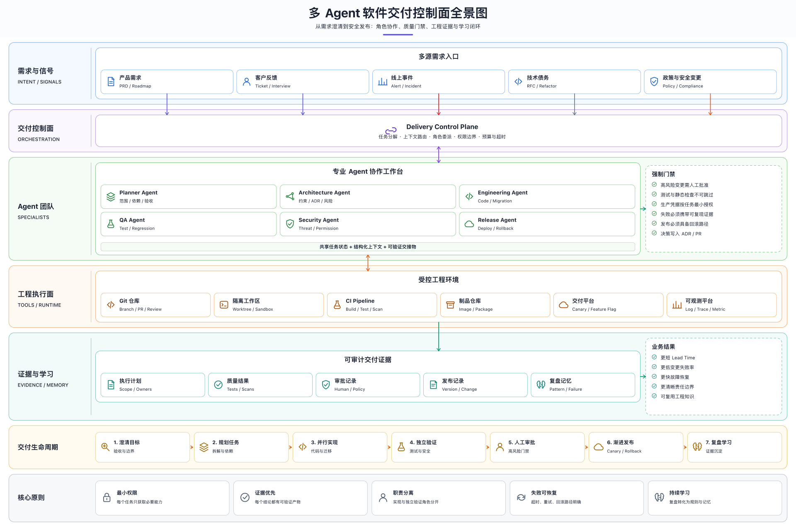
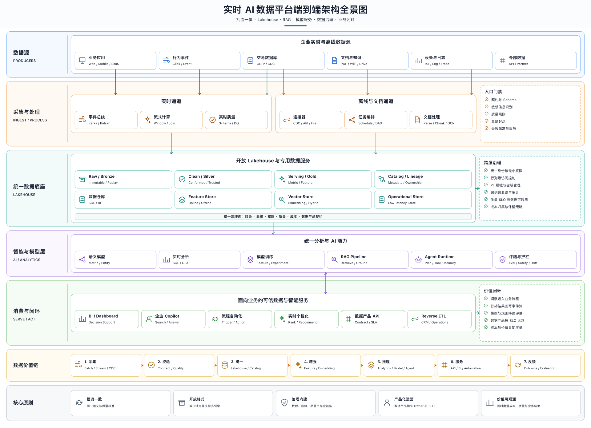

<p align="center">
  
</p>

<h1 align="center">VisualSpec</h1>

<p align="center"><strong>Install the Skill. Describe the system. Get the diagram.</strong><br>安装 Skill，描述系统，直接得到漂亮的交付图。</p>

<p align="center">
  Prompt-native diagram framework and Agent Skill for architecture, workflows, data flows, product maps, topology, decisions, and strategy.
</p>

<p align="center">
  <a href="https://github.com/georgelu-creator/abi-flow/actions/workflows/ci.yml"></a>
  <a href="LICENSE"></a>
  
  
  
</p>

[](examples/generated/enterprise-agent-office.svg)

**VisualSpec is an Agent Skill first.** Install `$abi-flow`, describe the system, and the Agent produces the finished PNG/SVG/HTML—not a Mermaid snippet that you still have to redesign. The Skill selects a diagram contract, authors reproducible JSON, renders it with deterministic layout and built-in icons, validates geometry, inspects the 1920-pixel PNG, and corrects weak output before delivery.

For dense enterprise overviews, the `board` composition generates layered color bands, bilingual module grids, side explanations, semantic cross-layer arrows, numbered data flows, and principle cards. **VisualSpec Studio is an optional inspection/editing surface**, not a prerequisite for getting a good diagram.

The repository and public Skill id remain `abi-flow` for compatibility; the project brand and expanded framework are now **VisualSpec**.

## Why VisualSpec

- **Finished visual, not diagram source** — PNG/SVG is the default deliverable; JSON and quality evidence keep it reproducible.
- **Quality advantage through constraints** — type contracts, board composition, icon vocabulary, text measurement, semantic routing, strict validation, and mandatory visual review outperform one-shot freehand SVG/Mermaid.
- **Meaning before pixels** — capture actors, boundaries, relationships, branches, and feedback before layout.
- **10 diagram contracts** — each type has a use case, input schema, fixed layout rules, visual rules, a starter source, and an example prompt.
- **Agent-native** — install and invoke the included `$abi-flow` Skill from compatible agents.
- **Deterministic output** — the same JSON produces reviewable SVG, HTML, PNG, and a quality report.
- **High-density enterprise boards** — 20–45 concepts remain readable through scan bands, nested grids, side lists, process strips, and principles.
- **Import without lock-in** — CSV becomes native VisualSpec; Mermaid source stays intact and uses the official renderer.
- **Optional browser inspection** — React Flow, ELK, Monaco, imports, offline persistence, and drill-down are available when manual review is genuinely useful.
- **Enterprise visual language** — Chinese-first labels, preserved English technical terms, low-saturation themes, semantic nodes and arrows.
- **Quality gates** — cycles, references, unsafe links, overlaps, edge/node collisions, crossings, accessibility, and SVG integrity are checked.
- **Zero required runtime dependencies** — SVG and HTML rendering use only the Python standard library; PNG export optionally uses `rsvg-convert`.

## Diagram types

| Type | Best for | Fixed layout |
|---|---|---|
| System architecture | Layers, boundaries, integrations, sources of truth | Enterprise board or TB graph |
| Agent workflow | Plan, context, tools, verification, memory loop | Left → right |
| Data flow | Sources, ingestion, transforms, storage, serving | Left → right |
| Capability map | North star, capability domains, outcomes | Top → bottom |
| User flow | Entry, action, decision, recovery, success | Happy path centered |
| System topology | Edge, service/data planes, runtime dependencies | Left → right |
| Decision tree | Ordered questions and terminal outcomes | Top → bottom |
| Roadmap | Phases, milestones, readiness dependencies | Left → right |
| Strategy map | Vision, pillars, initiatives, key results | Top → bottom |
| Process flow | Procedures, handoffs, approvals, exceptions | LR or TB |

Every type has a dedicated guide under [`references/diagram-types`](skills/abi-flow/references/diagram-types) and a valid starter under [`templates`](skills/abi-flow/templates).

## How it works

`Intent → diagram contract → graph or enterprise board → deterministic render → strict checks → 1920 px visual review → finished image`

1. **Choose the information model.** The Skill routes the request to one primary diagram type.
2. **Normalize the content.** Audience, scope, actors, relationships, boundaries, language, theme, and outputs become an explicit brief.
3. **Choose composition.** Small relationship diagrams use graph layout; layered overviews use a high-density enterprise board.
4. **Author the source of truth.** JSON records meaning independently of generated pixels.
5. **Render.** The standard-library engine computes bands, grids, nodes, icons, semantic routes, and portable artifacts.
6. **Gate quality.** Strict validation plus full-size PNG inspection catches structural, geometry, text, accessibility, and hierarchy problems before delivery.

The implementation deliberately reuses [React Flow](https://reactflow.dev/learn/layouting/sub-flows), [ELK](https://eclipse.dev/elk/reference/algorithms/org-eclipse-elk-layered.html), [Mermaid](https://mermaid.js.org/config/usage.html), [Papa Parse](https://www.papaparse.com/docs), [Monaco](https://microsoft.github.io/monaco-editor/), and [Yjs](https://docs.yjs.dev/). The research and boundaries are recorded in [`docs/research-and-architecture.md`](docs/research-and-architecture.md).

## Quick start

### Install as an Agent Skill

```bash
npx skills add georgelu-creator/abi-flow --skill abi-flow
```

Or copy [`skills/abi-flow`](skills/abi-flow) into a compatible agent's skills directory.

Then ask the Agent for the finished visual:

```text
Use $abi-flow to generate a Chinese-first enterprise architecture board for our
cross-device Agent workspace. Show users/Agents, access gateway, core memory and
context capabilities, tool integrations, sources of truth, a six-step task flow,
and five architecture principles. Deliver and inspect PNG + SVG + HTML + JSON.
```

The expected result is a rendered image like the hero above. Opening a browser editor is not part of the normal generation workflow.

### Create a diagram from a template

```bash
# See every supported contract
python3 skills/abi-flow/scripts/abi_flow.py types

# Create an editable architecture source
python3 skills/abi-flow/scripts/abi_flow.py new system-architecture \
  --output work/my-architecture.json

# Validate and render
python3 skills/abi-flow/scripts/abi_flow.py validate work/my-architecture.json --strict
python3 skills/abi-flow/scripts/abi_flow.py render work/my-architecture.json \
  --output-dir output \
  --name my-architecture \
  --png \
  --strict
```

Outputs:

- `my-architecture.svg` — editable, source-control-friendly vector
- `my-architecture.html` — dependency-free viewer with pan/zoom and downloads; graph views also include light/dark switching
- `my-architecture.png` — 1920 px preview when `rsvg-convert` is available
- `my-architecture.quality.json` — validation and geometry evidence

### Optional: inspect in VisualSpec Studio

Requires Node.js 20.19+ or 22.12+.

```bash
cd editor
npm install
npm run dev
```

Studio is an add-on for manual graph/workspace inspection or import workflows. High-density boards already ship with a zoomable standalone HTML viewer and do not require Studio. Studio runs locally and includes:

- React Flow editing with selection, drag, connect, delete, pan, zoom, minimap, and lane parents;
- ELK Layered automatic layout plus explicit `rank` and saved manual positions;
- CSV, Mermaid, and full Workspace JSON import;
- brand preset and color-token controls;
- multiple native or Mermaid views with double-click drill-down;
- Monaco source editing, live validation, IndexedDB offline restore, and optional Yjs WebSocket sync.

No public CDN is required. See [`editor.md`](skills/abi-flow/references/editor.md) and the checked-in [`enterprise-ai-workspace.json`](examples/enterprise-ai-workspace.json).

### Start from JSON

```json
{
  "title": "变更发布流程",
  "subtitle": "从候选变更到稳定发布",
  "diagram_type": "process-flow",
  "direction": "LR",
  "theme": "paper",
  "nodes": [
    {"id": "change", "label": "候选变更", "type": "input"},
    {"id": "test", "label": "自动验证", "type": "process"},
    {"id": "release", "label": "发布", "type": "process"}
  ],
  "edges": [
    {"source": "change", "target": "test", "kind": "primary"},
    {"source": "test", "target": "release", "kind": "success"}
  ]
}
```

The full format is documented in [`spec.md`](skills/abi-flow/references/spec.md) and [`spec.schema.json`](skills/abi-flow/references/spec.schema.json).

## Skill invocation

```text
Use $abi-flow to create a Chinese-first system architecture diagram for our enterprise AI workspace.
Audience: product and engineering leadership.
Include: users and Agents, unified gateway, memory/context, tool orchestration,
GitHub and document sources of truth, audit and learning feedback.
Use a modern low-saturation SaaS style and deliver JSON, SVG, HTML, PNG, and quality evidence.
```

The Skill accepts prose or these structured parameters:

| Parameter | Meaning |
|---|---|
| `goal` | Decision or understanding the diagram should support |
| `diagram_type` | One of the 10 supported slugs |
| `audience` | Executive, product, engineering, customer, etc. |
| `content` | Actors, systems, steps, capabilities, milestones, or questions |
| `relationships` | Primary, control, async, success, error, and feedback links |
| `boundaries` | Layers, owners, stages, domains, or trust zones |
| `composition` | `board` for high-density layered overviews; `graph` for smaller relationship diagrams |
| `lanes` / `rank` | Swimlane ownership and explicit hierarchy |
| `language` | Chinese-first by default; technical English retained |
| `theme` | `paper`, `notion`, `spectrum`, `blueprint`, or `terminal` |
| `brand` | Allowlisted brand colors layered over a preset |
| `views` | Overview/detail views linked by `child_view` |
| `imports` | Mermaid source or CSV node/edge table |
| `outputs` | JSON plus SVG, HTML, PNG, and/or quality report |

See the reusable [`prompt-system.md`](skills/abi-flow/references/prompt-system.md) for the normalized brief and copy/paste generation contract.

## Example gallery

These are not hand-designed screenshots. Every image below is generated by the bundled Skill renderer from checked-in JSON and has matching SVG, standalone HTML, PNG, and quality evidence in [`examples/generated`](examples/generated).

### Cross-device Agent workspace

[](examples/generated/enterprise-agent-office.svg)

41 visible elements · five architecture layers · memory capability grid · tool and asset boundaries · six-step task flow · five principles. [Source JSON](examples/enterprise-agent-office.json) · [HTML](examples/generated/enterprise-agent-office.html) · [quality](examples/generated/enterprise-agent-office.quality.json)

### Multi-Agent software delivery control plane

[](examples/generated/multi-agent-delivery-control-plane.svg)

Demand signals · orchestration · six specialist Agents · mandatory gates · controlled engineering runtime · auditable evidence · delivery lifecycle. [Source JSON](examples/multi-agent-delivery-control-plane.json) · [HTML](examples/generated/multi-agent-delivery-control-plane.html) · [quality](examples/generated/multi-agent-delivery-control-plane.quality.json)

### Real-time AI data platform

[](examples/generated/realtime-ai-data-platform.svg)

Batch/stream sources · ingestion planes · governed Lakehouse · RAG and Agent runtime · business serving · feedback loop. [Source JSON](examples/realtime-ai-data-platform.json) · [HTML](examples/generated/realtime-ai-data-platform.html) · [quality](examples/generated/realtime-ai-data-platform.quality.json)

### Additional graph contracts

The same Skill also generates [swimlane release flows](examples/generated/swimlane-release.svg), [capability maps](examples/generated/capability-map.svg), [user flows](examples/generated/user-flow.svg), [system topology](examples/generated/system-topology.svg), decision trees, roadmaps, and strategy maps. The fictional [Aurora Deep-Space Resilience Network](examples/generated/aurora-resilience-network.svg) remains a dense graph stress case.

## Design principles

1. **Structure first.** Information architecture is fixed before visual treatment.
2. **One canvas, one message.** Split overloaded diagrams instead of shrinking text.
3. **Semantics over decoration.** Shapes and arrows carry consistent meaning across themes.
4. **Chinese-first, globally legible.** Chinese primary labels pair with stable English technical vocabulary.
5. **High density, easy scanning.** Use layers, groups, hierarchy, and whitespace—not tiny type.
6. **Reproducible by default.** Source JSON and generated evidence travel with every diagram.
7. **Accessible and safe.** Color is not the only signal; links and embedded text are validated and escaped.

## Import contracts

Mermaid is imported as a source view and validated/rendered by Mermaid itself in strict security mode. VisualSpec does not pretend that every Mermaid diagram has been losslessly converted to native nodes.

CSV imports support `node_id`, `label`, `type`, `lane`, `lane_label`, `rank`, `child_view`, `source`, `target`, `edge_label`, and `edge_kind`. A simple `source,target,source_label,target_label` edge table is also accepted. See [`imports.md`](skills/abi-flow/references/imports.md).

Multi-view files use `schema_version: "3.0"`, one `entry_view`, native `visualspec` views, optional `mermaid` views, and node `child_view` links. See [`workspaces.md`](skills/abi-flow/references/workspaces.md) and [`workspace.schema.json`](skills/abi-flow/references/workspace.schema.json).

## Project structure

```text
.
├── skills/abi-flow/
│   ├── SKILL.md                     # Agent entrypoint and routing
│   ├── agents/openai.yaml           # Skill UI metadata
│   ├── assets/icon.svg              # VisualSpec brand mark
│   ├── references/
│   │   ├── prompt-system.md         # Stable prompt and input contract
│   │   ├── enterprise-board.md      # High-density architecture composition
│   │   ├── diagram-types/*.md       # 10 type-specific contracts
│   │   ├── spec.md                  # JSON authoring guide
│   │   ├── spec.schema.json         # Editor/schema support
│   │   ├── workspace.schema.json    # Multi-view workspace contract
│   │   ├── editor.md                # Browser editor workflow
│   │   ├── imports.md               # Mermaid/CSV contracts
│   │   ├── workspaces.md            # Drill-down model
│   │   ├── visual-language.md       # Themes and semantics
│   │   └── quality-contract.md      # Delivery gates
│   ├── templates/*.json             # 10 validated starter sources
│   └── scripts/abi_flow.py          # Renderer, scaffolder, validator
├── examples/                         # Complex board + graph source JSON
├── examples/generated/              # Reproducible SVG, HTML, PNG, reports
├── editor/                           # Optional React/TypeScript Studio
│   ├── src/                          # React Flow, ELK, import and realtime adapters
│   ├── package.json                  # Pinned browser dependencies and checks
│   └── vite.config.ts                # Local and production build
├── docs/research-and-architecture.md # Adopted components and boundaries
├── tests/test_abi_flow.py            # Behavior and security coverage
├── CONTRIBUTING.md
├── SECURITY.md
└── AUDIT.md
```

## Roadmap

- [x] Typed diagram protocol and 10 starter contracts
- [x] Chinese-first enterprise visual system and five themes
- [x] Deterministic SVG/HTML/PNG rendering and quality evidence
- [x] Agent Skill packaging with progressive references
- [x] Multi-type example gallery
- [x] Swimlanes and explicit manual rank hints for dense enterprise flows
- [x] Mermaid and CSV/table import adapters
- [x] Theme tokens and brand-kit overrides in the JSON spec
- [x] Multi-view projects with overview → drill-down links
- [x] Browser editor with live JSON/Mermaid validation and offline persistence
- [x] High-density enterprise board renderer with section grids, side lists, built-in icons, data-flow and principle strips
- [ ] Authenticated shared rooms, presence cursors, and deployable collaboration server recipe
- [ ] diagrams.net import/export adapter and portable workspace HTML export
- [ ] Command palette, undo history UI, and plugin API for custom nodes

## Contributing

Contributions are welcome for new diagram contracts, layout improvements, themes, accessibility, and examples. Read [`CONTRIBUTING.md`](CONTRIBUTING.md), keep changes scoped, and include a strict-validating source plus tests for behavior changes.

## Development

```bash
python3 -m unittest discover -s tests -v
for spec in skills/abi-flow/templates/*.json; do
  python3 skills/abi-flow/scripts/abi_flow.py validate "$spec" --strict
done
python3 ~/.codex/skills/.system/skill-creator/scripts/quick_validate.py skills/abi-flow
python3 skills/abi-flow/scripts/abi_flow.py workspace-validate examples/enterprise-ai-workspace.json --strict
cd editor && npm ci && npm run typecheck && npm test && npm run build && npm audit
```

Release evidence and known limitations are recorded in [`AUDIT.md`](AUDIT.md).

## Scope

VisualSpec is optimized for explanatory diagrams: architecture, workflows, data movement, capability structures, topology, decisions, and strategy. The Python renderer has zero required third-party runtime dependencies; the separate browser editor uses audited open-source packages. VisualSpec is not a quantitative charting library, BPMN execution engine, general whiteboard, or unrestricted illustration generator.

## License

MIT. See [`LICENSE`](LICENSE). Conceptual inspirations and provenance are documented in [`NOTICE.md`](NOTICE.md).
