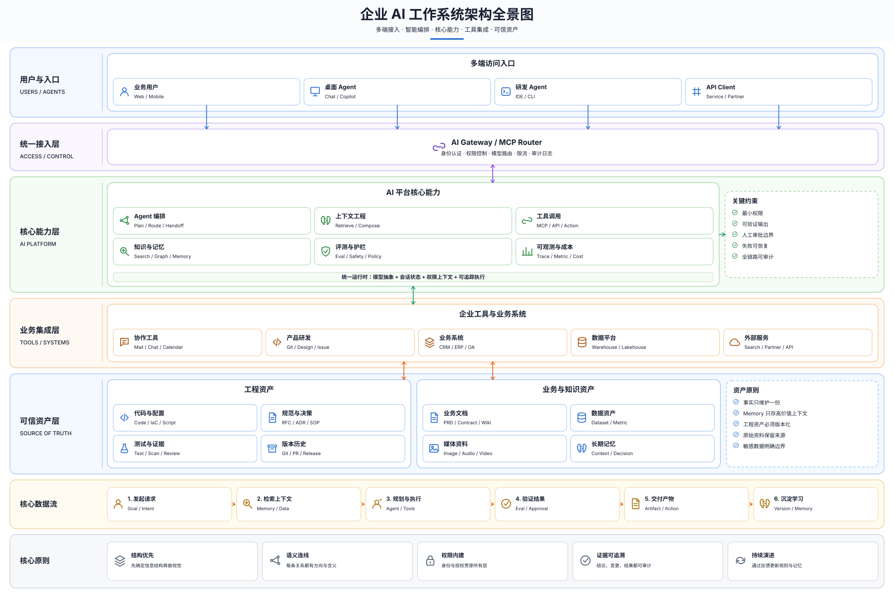

<p align="center">
  
</p>

<h1 align="center">VisualSpec</h1>

<p align="center"><strong>Describe the system. Ship the diagram.</strong><br>描述系统，交付图表。</p>

<p align="center">
  Prompt-native diagram framework and Agent Skill for architecture, workflows, data flows, product maps, topology, decisions, and strategy.
</p>

<p align="center">
  <a href="https://github.com/georgelu-creator/abi-flow/actions/workflows/ci.yml"></a>
  <a href="LICENSE"></a>
  
  
</p>

[](examples/generated/system-architecture.svg)

VisualSpec turns natural-language intent or structured content into a version-controlled JSON specification, then renders polished SVG, responsive interactive HTML, optional PNG, and machine-readable quality evidence. It is built for diagrams that must survive revision—not one-off pictures that cannot be reproduced.

The repository and public Skill id remain `abi-flow` for compatibility; the project brand and expanded framework are now **VisualSpec**.

## Why VisualSpec

- **Meaning before pixels** — capture actors, boundaries, relationships, branches, and feedback before layout.
- **10 diagram contracts** — each type has a use case, input schema, fixed layout rules, visual rules, a starter source, and an example prompt.
- **Agent-native** — install and invoke the included `$abi-flow` Skill from compatible agents.
- **Deterministic output** — the same JSON produces reviewable SVG, HTML, PNG, and a quality report.
- **Enterprise visual language** — Chinese-first labels, preserved English technical terms, low-saturation themes, semantic nodes and arrows.
- **Quality gates** — cycles, references, unsafe links, overlaps, edge/node collisions, crossings, accessibility, and SVG integrity are checked.
- **Zero required runtime dependencies** — SVG and HTML rendering use only the Python standard library; PNG export optionally uses `rsvg-convert`.

## Diagram types

| Type | Best for | Fixed layout |
|---|---|---|
| System architecture | Layers, boundaries, integrations, sources of truth | Top → bottom |
| Agent workflow | Plan, context, tools, verification, memory loop | Left → right |
| Data flow | Sources, ingestion, transforms, storage, serving | Left → right |
| Capability map | North star, capability domains, outcomes | Top → bottom |
| User flow | Entry, action, decision, recovery, success | Happy path centered |
| System topology | Edge, service/data planes, runtime dependencies | Left → right |
| Decision tree | Ordered questions and terminal outcomes | Top → bottom |
| Roadmap | Phases, milestones, readiness dependencies | Left → right |
| Strategy map | Vision, pillars, initiatives, key results | Top → bottom |
| Process flow | Procedures, handoffs, approvals, exceptions | LR or TB |

Every type has a dedicated guide under [`references/diagram-types`](skills/abi-flow/references/diagram-types) and a valid starter under [`templates`](skills/abi-flow/templates).

## How it works

`Intent → normalized brief → typed JSON spec → deterministic layout → SVG/HTML/PNG → quality evidence`

1. **Choose the information model.** The Skill routes the request to one primary diagram type.
2. **Normalize the content.** Audience, scope, actors, relationships, boundaries, language, theme, and outputs become an explicit brief.
3. **Author the source of truth.** A small JSON graph records meaning independently of presentation.
4. **Render.** The standard-library engine lays out nodes, routes semantic arrows, applies a theme, and creates portable artifacts.
5. **Gate quality.** Strict validation catches structural, geometry, accessibility, and security problems before delivery.

## Quick start

### Install as an Agent Skill

```bash
npx skills add georgelu-creator/abi-flow --skill abi-flow
```

Or copy [`skills/abi-flow`](skills/abi-flow) into a compatible agent's skills directory.

### Create a diagram from a template

```bash
# See every supported contract
python3 skills/abi-flow/scripts/abi_flow.py types

# Create an editable architecture source
python3 skills/abi-flow/scripts/abi_flow.py new system-architecture \
  --output work/my-architecture.json

# Validate and render
python3 skills/abi-flow/scripts/abi_flow.py validate work/my-architecture.json --strict
python3 skills/abi-flow/scripts/abi_flow.py render work/my-architecture.json \
  --output-dir output \
  --name my-architecture \
  --png \
  --strict
```

Outputs:

- `my-architecture.svg` — editable, source-control-friendly vector
- `my-architecture.html` — dependency-free viewer with pan/zoom, light/dark mode, and downloads
- `my-architecture.png` — 1920 px preview when `rsvg-convert` is available
- `my-architecture.quality.json` — validation and geometry evidence

### Start from JSON

```json
{
  "title": "变更发布流程",
  "subtitle": "从候选变更到稳定发布",
  "diagram_type": "process-flow",
  "direction": "LR",
  "theme": "paper",
  "nodes": [
    {"id": "change", "label": "候选变更", "type": "input"},
    {"id": "test", "label": "自动验证", "type": "process"},
    {"id": "release", "label": "发布", "type": "process"}
  ],
  "edges": [
    {"source": "change", "target": "test", "kind": "primary"},
    {"source": "test", "target": "release", "kind": "success"}
  ]
}
```

The full format is documented in [`spec.md`](skills/abi-flow/references/spec.md) and [`spec.schema.json`](skills/abi-flow/references/spec.schema.json).

## Skill invocation

```text
Use $abi-flow to create a Chinese-first system architecture diagram for our enterprise AI workspace.
Audience: product and engineering leadership.
Include: users and Agents, unified gateway, memory/context, tool orchestration,
GitHub and document sources of truth, audit and learning feedback.
Use a modern low-saturation SaaS style and deliver JSON, SVG, HTML, PNG, and quality evidence.
```

The Skill accepts prose or these structured parameters:

| Parameter | Meaning |
|---|---|
| `goal` | Decision or understanding the diagram should support |
| `diagram_type` | One of the 10 supported slugs |
| `audience` | Executive, product, engineering, customer, etc. |
| `content` | Actors, systems, steps, capabilities, milestones, or questions |
| `relationships` | Primary, control, async, success, error, and feedback links |
| `boundaries` | Layers, owners, stages, domains, or trust zones |
| `language` | Chinese-first by default; technical English retained |
| `theme` | `paper`, `notion`, `spectrum`, `blueprint`, or `terminal` |
| `outputs` | JSON plus SVG, HTML, PNG, and/or quality report |

See the reusable [`prompt-system.md`](skills/abi-flow/references/prompt-system.md) for the normalized brief and copy/paste generation contract.

## Example gallery

All gallery images below are generated by this repository from checked-in JSON templates. Each has matching SVG, interactive HTML, PNG, and quality evidence in [`examples/generated`](examples/generated).

<table>
  <tr>
    <td width="50%"><a href="examples/generated/agent-workflow.svg"></a><br><strong>Agent 工作流</strong><br>Plan → context → gate → tools → verify → memory.</td>
    <td width="50%"><a href="examples/generated/data-flow.svg"></a><br><strong>数据流图</strong><br>Source → ingestion → compute/store → model → experience.</td>
  </tr>
  <tr>
    <td width="50%"><a href="examples/generated/capability-map.svg"></a><br><strong>产品能力地图</strong><br>North star → capabilities → measurable outcomes.</td>
    <td width="50%"><a href="examples/generated/user-flow.svg"></a><br><strong>用户流程图</strong><br>Happy path, hesitation branch, recovery, and activation.</td>
  </tr>
  <tr>
    <td colspan="2"><a href="examples/generated/system-topology.svg"></a><br><strong>系统拓扑图</strong><br>Dark blueprint view of edge, service, data, and observability planes.</td>
  </tr>
</table>

The fictional [Aurora Deep-Space Resilience Network](examples/generated/aurora-resilience-network.svg) remains as a larger spectrum-theme stress example.

## Design principles

1. **Structure first.** Information architecture is fixed before visual treatment.
2. **One canvas, one message.** Split overloaded diagrams instead of shrinking text.
3. **Semantics over decoration.** Shapes and arrows carry consistent meaning across themes.
4. **Chinese-first, globally legible.** Chinese primary labels pair with stable English technical vocabulary.
5. **High density, easy scanning.** Use layers, groups, hierarchy, and whitespace—not tiny type.
6. **Reproducible by default.** Source JSON and generated evidence travel with every diagram.
7. **Accessible and safe.** Color is not the only signal; links and embedded text are validated and escaped.

## Project structure

```text
.
├── skills/abi-flow/
│   ├── SKILL.md                     # Agent entrypoint and routing
│   ├── agents/openai.yaml           # Skill UI metadata
│   ├── assets/icon.svg              # VisualSpec brand mark
│   ├── references/
│   │   ├── prompt-system.md         # Stable prompt and input contract
│   │   ├── diagram-types/*.md       # 10 type-specific contracts
│   │   ├── spec.md                  # JSON authoring guide
│   │   ├── spec.schema.json         # Editor/schema support
│   │   ├── visual-language.md       # Themes and semantics
│   │   └── quality-contract.md      # Delivery gates
│   ├── templates/*.json             # 10 validated starter sources
│   └── scripts/abi_flow.py          # Renderer, scaffolder, validator
├── examples/generated/              # SVG, HTML, PNG, quality reports
├── tests/test_abi_flow.py            # Behavior and security coverage
├── CONTRIBUTING.md
├── SECURITY.md
└── AUDIT.md
```

## Roadmap

- [x] Typed diagram protocol and 10 starter contracts
- [x] Chinese-first enterprise visual system and five themes
- [x] Deterministic SVG/HTML/PNG rendering and quality evidence
- [x] Agent Skill packaging with progressive references
- [x] Multi-type example gallery
- [ ] Swimlanes and explicit manual rank hints for dense enterprise flows
- [ ] Import adapters for Mermaid and CSV/table sources
- [ ] Theme tokens and brand-kit overrides in the JSON spec
- [ ] Multi-view projects with overview → drill-down links
- [ ] Browser-based source editor and live validation

## Contributing

Contributions are welcome for new diagram contracts, layout improvements, themes, accessibility, and examples. Read [`CONTRIBUTING.md`](CONTRIBUTING.md), keep changes scoped, and include a strict-validating source plus tests for behavior changes.

## Development

```bash
python3 -m unittest discover -s tests -v
for spec in skills/abi-flow/templates/*.json; do
  python3 skills/abi-flow/scripts/abi_flow.py validate "$spec" --strict
done
python3 ~/.codex/skills/.system/skill-creator/scripts/quick_validate.py skills/abi-flow
```

Release evidence and known limitations are recorded in [`AUDIT.md`](AUDIT.md).

## Scope

VisualSpec is optimized for explanatory diagrams: architecture, workflows, data movement, capability structures, topology, decisions, and strategy. It is not a quantitative charting library, BPMN engine, general whiteboard, or unrestricted illustration generator.

## License

MIT. See [`LICENSE`](LICENSE). Conceptual inspirations and provenance are documented in [`NOTICE.md`](NOTICE.md).
