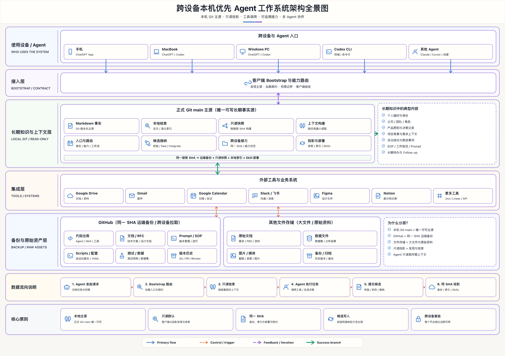
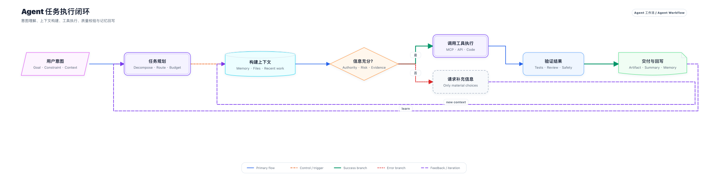
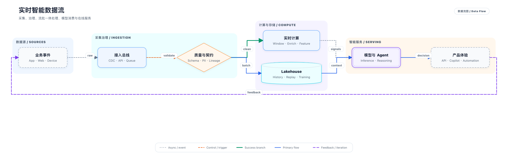
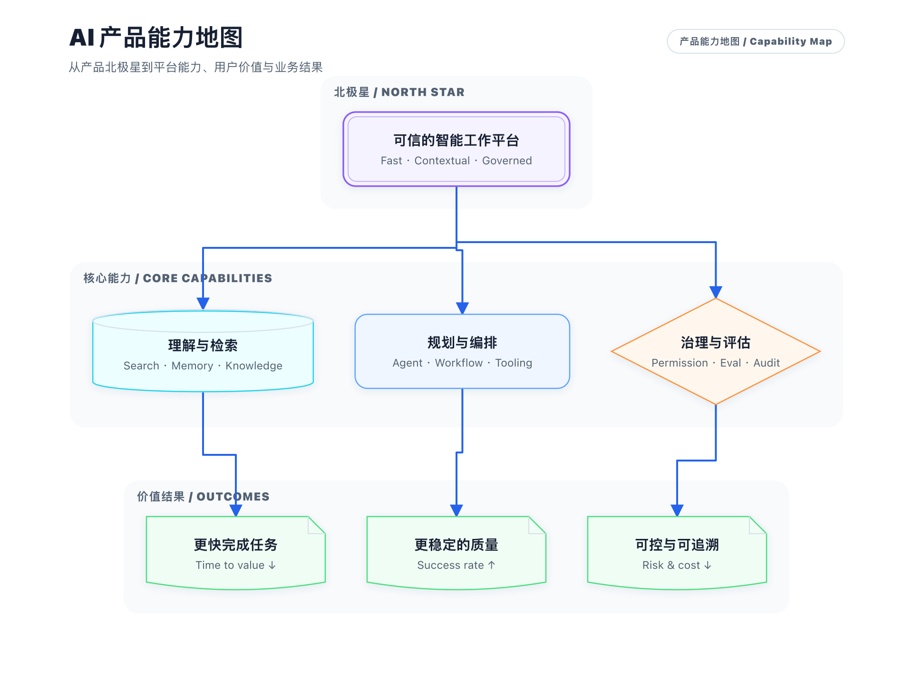
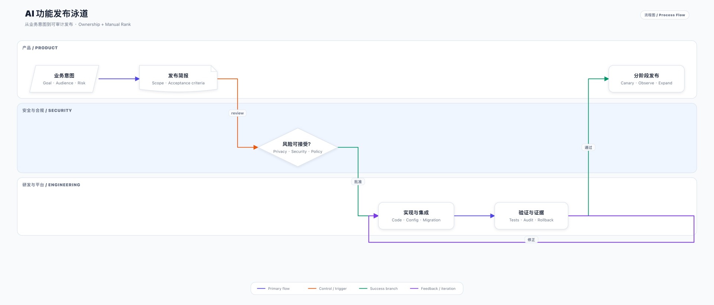
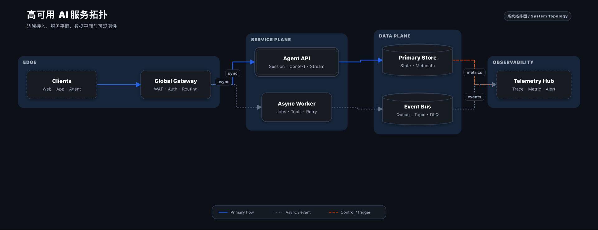
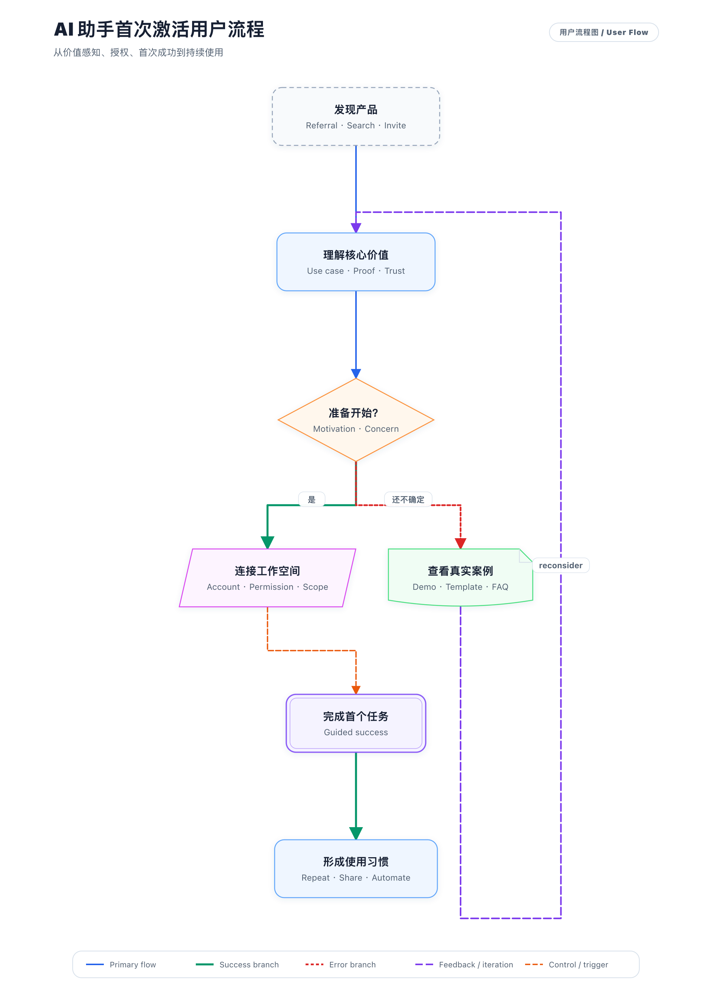

<p align="center">
  
</p>

<p align="center"><strong>简体中文</strong> · <a href="README.md">English</a></p>

<h1 align="center">DiagramSkills</h1>

<p align="center"><strong>让 AI Agent 直接交付真正能用的漂亮图。</strong></p>

<p align="center">
  把复杂系统、流程、数据与策略，变成清晰、可信、可持续修改的企业级视觉成果。<br>
  架构图 · Agent 工作流 · 数据流 · 能力地图 · 用户流程 · 系统拓扑 · 决策树 · Roadmap
</p>

<p align="center">
  <a href="https://github.com/georgelu-creator/diagram-skills/actions/workflows/ci.yml"></a>
  <a href="LICENSE"></a>
  
  
</p>

```bash
npx skills add georgelu-creator/diagram-skills --skill diagram-skills
```

<p align="center">
  <a href="examples/generated/enterprise-agent-office.svg">
    
  </a>
</p>

> **安装后可以直接这样说**
>
> 使用 `$diagram-skills` 为产品和研发负责人画一张 AI 工作系统全景架构图。展示用户与 Agent、统一接入网关、记忆与上下文、外部工具、工程与文件事实源、端到端任务流，以及系统设计原则。中文为主，保留稳定的英文技术词；直接交付完成的图和可修改源文件。

## 它不是又一个通用流程图工具

DiagramSkills 的主产品是安装后由 Agent 自动完成的出图闭环：先厘清故事与边界，再选择视觉语法，生成可维护的 DiagramSpec JSON，经过约束布局、结构检查和视觉复核，最后交付 SVG、独立 HTML、质量证据，以及本机支持时的 PNG。

浏览器 Studio 是附加工具，不是使用门槛。日常修改应优先让 Agent 更新语义源并重新生成，人不需要拖拽像素才能得到成品。

## 七种真实图例

<table>
  <tr>
    <td width="50%" valign="top">
      <a href="examples/generated/enterprise-agent-office.svg"></a><br>
      <strong>Agent 工作系统架构图</strong><br>
      <sub>分层展示入口、控制、记忆、工具、事实源、数据流与原则。</sub><br>
      <a href="examples/enterprise-agent-office.json">源文件</a> · <a href="examples/generated/enterprise-agent-office.html">交互 HTML</a> · <a href="examples/generated/enterprise-agent-office.quality.json">质量报告</a>
    </td>
    <td width="50%" valign="top">
      <a href="examples/generated/agent-workflow.svg"></a><br>
      <strong>Agent 执行工作流</strong><br>
      <sub>把规划、上下文、工具调用、验证、补充信息与学习反馈讲清楚。</sub><br>
      <a href="skills/diagram-skills/templates/agent-workflow.json">源文件</a> · <a href="examples/generated/agent-workflow.html">交互 HTML</a> · <a href="examples/generated/agent-workflow.quality.json">质量报告</a>
    </td>
  </tr>
  <tr>
    <td width="50%" valign="top">
      <a href="examples/generated/data-flow.svg"></a><br>
      <strong>实时 AI 数据流</strong><br>
      <sub>追踪来源、采集、治理、计算、存储、模型服务与反馈。</sub><br>
      <a href="skills/diagram-skills/templates/data-flow.json">源文件</a> · <a href="examples/generated/data-flow.html">交互 HTML</a> · <a href="examples/generated/data-flow.quality.json">质量报告</a>
    </td>
    <td width="50%" valign="top">
      <a href="examples/generated/capability-map.svg"></a><br>
      <strong>AI 产品能力地图</strong><br>
      <sub>连接产品北极星、平台能力、治理能力与价值结果。</sub><br>
      <a href="skills/diagram-skills/templates/capability-map.json">源文件</a> · <a href="examples/generated/capability-map.html">交互 HTML</a> · <a href="examples/generated/capability-map.quality.json">质量报告</a>
    </td>
  </tr>
  <tr>
    <td width="50%" valign="top">
      <a href="examples/generated/swimlane-release.svg"></a><br>
      <strong>AI 功能发布泳道</strong><br>
      <sub>让产品、安全与工程之间的责任、审批、证据和返工路径可见。</sub><br>
      <a href="examples/swimlane-release.json">源文件</a> · <a href="examples/generated/swimlane-release.html">交互 HTML</a> · <a href="examples/generated/swimlane-release.quality.json">质量报告</a>
    </td>
    <td width="50%" valign="top">
      <a href="examples/generated/system-topology.svg"></a><br>
      <strong>高可用 AI 服务拓扑</strong><br>
      <sub>区分边缘、服务、数据与可观测平面，以及同步和异步路径。</sub><br>
      <a href="skills/diagram-skills/templates/system-topology.json">源文件</a> · <a href="examples/generated/system-topology.html">交互 HTML</a> · <a href="examples/generated/system-topology.quality.json">质量报告</a>
    </td>
  </tr>
  <tr>
    <td colspan="2" valign="top" align="center">
      <a href="examples/generated/user-flow.svg"></a><br>
      <strong>AI 助手首次激活用户流程</strong><br>
      <sub>展示发现、价值理解、开始决策、授权连接、首次成功、持续使用和不确定性恢复。</sub><br>
      <a href="skills/diagram-skills/templates/user-flow.json">源文件</a> · <a href="examples/generated/user-flow.html">交互 HTML</a> · <a href="examples/generated/user-flow.quality.json">质量报告</a>
    </td>
  </tr>
</table>

完整索引见 [`examples/README.md`](examples/README.md)，首页图库的机器可读清单见 [`gallery/manifest.json`](gallery/manifest.json)。

## 工作方式

```text
目标与受众
  → Diagram Brief：故事、范围、重点、不确定性、失败风险
  → 选择一种主要视觉语法
  → 可维护的 DiagramSpec JSON
  → 约束布局与渲染
  → 结构、几何、无障碍与视觉复核
  → SVG / 独立 HTML / 可选 PNG + 源文件 + 质量证据
```

- 先决定图要解释什么，不是先选模板。
- 架构、工作流、数据流、能力地图、用户流程、拓扑、决策、Roadmap、战略和泳道各有独立契约。
- 中文主标签优先，稳定英文技术词保留在副标题。
- 关系、泳道、层级、分组、主题与品牌色都是语义源，不靠人工拖动维持。
- 高密度企业 Board 与普通关系图使用不同布局规则。
- 自动检查不能代替看图；未完成视觉复核的报告不会冒充最终通过。

## 快速开始

### 安装 Skill

```bash
npx skills add georgelu-creator/diagram-skills --skill diagram-skills
```

也可以把 [`skills/diagram-skills`](skills/diagram-skills) 复制到兼容 Agent 的 Skills 目录。安装包内已经包含模板、渲染器、类型说明和质量规则，不依赖仓库 Studio。

### 让 Agent 直接交付

```text
使用 $diagram-skills 解释这个代码仓库。

读者：刚加入的研发同学
目标：看懂入口、服务、数据存储、外部依赖、信任边界、失败路径和各层负责人。

请自己选择合适的图类型。未知事实要明确保留，不要补造。
交付完成的 SVG/HTML、可修改 JSON，以及本机支持时的 PNG 预览。
```

### 直接使用 CLI

```bash
python3 skills/diagram-skills/scripts/diagram_skills.py types
python3 skills/diagram-skills/scripts/diagram_skills.py new system-architecture --output work/architecture.json
python3 skills/diagram-skills/scripts/diagram_skills.py validate work/architecture.json --strict
python3 skills/diagram-skills/scripts/diagram_skills.py render work/architecture.json \
  --output-dir output --name architecture --strict
```

SVG、HTML 和质量报告只需要 Python 标准库。PNG 是本机可选集成；先运行渲染器的环境检查或安装兼容的 SVG rasterizer，再使用 `--png`。

## DiagramSkills Studio（附加能力）

完整仓库提供本地浏览器 Studio，用于直接编辑、泳道与手动层级、品牌预览、Mermaid/CSV 导入、多视图钻取和离线恢复：

```bash
cd editor
npm install
npm run dev
```

Studio 复用 React Flow、ELK、Monaco、Mermaid、Papa Parse、Zod 和 Yjs，不自造画布、布局引擎、代码编辑器、CSV 解析器或 CRDT。网络协作必须使用可信端点，并按 workspace/document id 隔离房间；它不是普通 Agent 出图的前置条件。

## 项目结构

```text
skills/diagram-skills/     可独立安装的 Agent Skill、模板、渲染器和规则
examples/            示例源文件、Brief 与生成产物
gallery/             首页图库清单
editor/              可选 DiagramSkills Studio
tests/               核心、证据链与安装包回归测试
.github/              CI、Issue/PR 模板和社交预览资产
```

## 范围与路线

当前重点是解释型视觉：架构、流程、数据移动、能力结构、拓扑、决策、Roadmap 与战略。它不是量化图表库、BPMN 执行引擎、无限白板或自由插画工具。

后续方向包括 Gallery 站点、视觉 diff、可移植的多视图导出、diagrams.net 互操作和经过认证的协作部署方案。兼容关系见 [`MIGRATION.md`](MIGRATION.md)，变更记录见 [`CHANGELOG.md`](CHANGELOG.md)。

## 参与贡献

欢迎提交视觉语法、布局质量、无障碍、模板、示例和文档改进。请先读 [`CONTRIBUTING.md`](CONTRIBUTING.md) 和 [`SECURITY.md`](SECURITY.md)。安全问题请使用 GitHub 的私密漏洞报告入口，不要把敏感图或漏洞细节放进公开 Issue。

## License

MIT，见 [`LICENSE`](LICENSE)。第三方方案与参考来源见 [`NOTICE.md`](NOTICE.md)。
